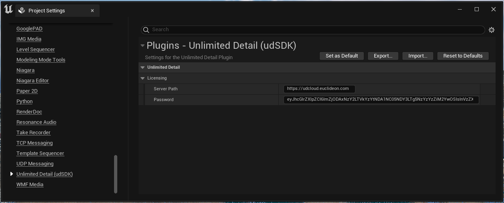
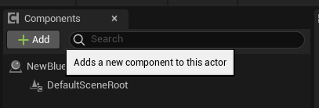
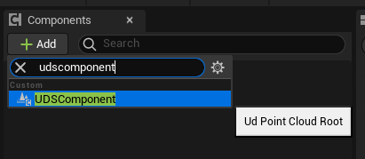
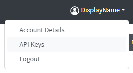
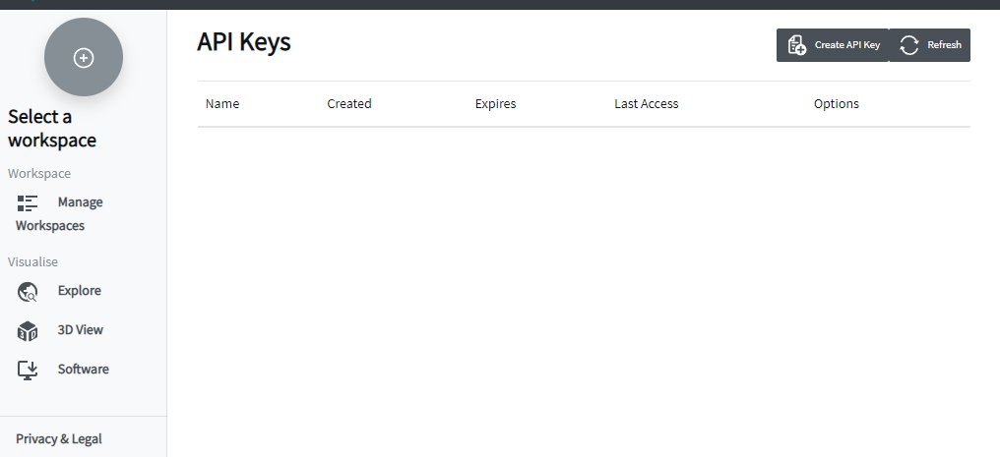
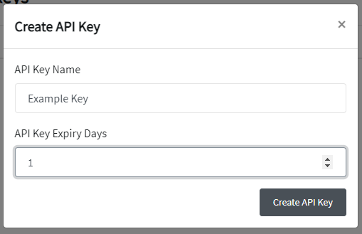
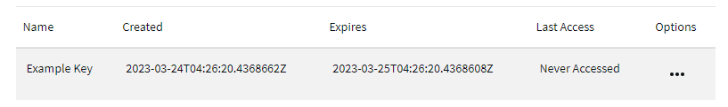
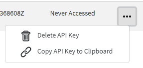
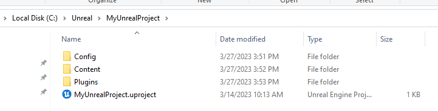

# !DOCS ARE UNDER CONSTRUCTION!
# Unlimited Detail for Unreal guide.

> Euclideon would like to thank community members [zengweicheng666](https://github.com/zengweicheng666) and [EuleeStar](https://github.com/EuleeStar) for their Unreal Engine 4 integration which is available on [GitHub](https://github.com/zengweicheng666/UdSDKProject). The Unreal Engine 5 plugin is built upon the foundation they built for UE4.

# Table of Contents

1. [Quick start summary](#example)
2. [Indepth guide](#example2)
    - [udCloud API Key](#example2)
    - [Installing the Unreal Plugin](#example2)
    - [Install the Unreal Plugin – Github Releases](#example2)
    - [Indepth guide ](#example2)
    - [Indepth guide ](#example2)
    - [Indepth guide ](#example2)
    - [Indepth guide ](#example2)
    - [Indepth guide ](#example2)
    

# Quick start summary

1. Ensure you have a valid udCloud API key. A valid key can be acquired for free from:
    1. https://udcloud.com/
1.	Ensure you have Unreal 5.1+ installed: 
    1.	https://docs.unrealengine.com/5.1/en-US/installing-unreal-engine/ 
1.	Ensure you have downloaded and installed the Unlimited Detail Unreal 5 plugin:
    1.	https://my.github.url.to.the.release.of.the.plugin.com 
    1.	https://docs.unrealengine.com/5.0/en-US/working-with-plugins-in-unreal-engine/  
1.	Ensure your API key is entered into the plugins Project Settings 
    1. 
1.	Restart Unreal (UDS will not start rendering until your API key is logged in, restarting will force that).
1.	Add the Unlimited Detail component to either a scene actor or an existing class:
    1. 
    1. 
1.	Assign a valid UDS URL to the component:
    1. 
    1. 
1.	A test asset can be accessed with the following URL: https://azmodels.vault.euclideon.com/Japan/0_1_0.uds
1.	Set the component scale to something large and immediately obvious:
    1. 
1.	Drag the actor into the Scene to begin rendering UDS!
    1. 

# Indepth guide 

## udCloud API Key
In order to use the Unlimited Detail Unreal plugin, you require a udCloud API key.

1. Navigate to https://udcloud.com/
1. Click the sing in/sign up button in the top right:
    - 
1. Clicking the Sign In / Sign up button yields the following window:
    - 
1. Create an account with any of the listed authentication methods.
1. After reading and accepting the EULA, Login. You will be greeted with the following window: 
    - 
1. Click your display name in the top right, to expand the following drop down:
    - 
1. Click "API Keys" to load the following page: 
    - 
1. Click on the top right button: 'Create API Key'
    
1. Enter a display name for the key, and (optionally) specify the number of days this key will be valid for.
1. Click **Create an API key**. It will be listed on the page like so: 
    - 
1. Under the “Options” column, click the **“...”** button on far right.
    - 
1. Click **Copy API Key** to Clipboard. Once copied, you will see the following confirmation:
    - 

For example, the following is the result of pasting the copied clipboard API key:

`eyJhcGlrZXlpZCI6IjAxMjM0NTY3OC0xMTExLTIyMjItMzMzMy00NDQ0NTU1NTY2NjYiLCJ1c2VyaWQiOiIwMTIzNDU2NzgtMTExMS0yMjIyLTMzMzMtNDQ0NDU1NTU2NjY2IiwidmVyc2lvbiI6IjEifQ==`

This API key can be used to authenticate your account to a variety of Euclideon software. Please ensure it is kept secure at all time, as anyone with access to this exact string can use any features your account is authorized to use. We recommend (if possible) ensuring your keys have a valid expiration date suited to your purposes.

Keep this key handy, as it is what we will paste into the Unreal Plugin.
 
## Installing the Unreal Plugin

The Unlimited Detail for Unreal plugin can be acquired either directly from the Unreal Marketplace or from our GitHub releases page, both approaches are equivalent and are detailed below:

## Install the Unreal Plugin – Github Releases

1. Navigate to https://my.github.url.to.the.release.of.the.plugin.com, and click Releases on the right:
1. Download the latest release.
1. Create a new Unreal project. Locate the folder, it should look something like this: 
    - 
1. Create a new folder alongside your .uproject file, and name it `Plugins` :
    - 
1. Open `Plugins` and create a new folder called `UdSDK`
1. Copy the contentse of the downloaded release from github into the `UdSDK` folder. The folder should resemble the following:
    - 

# Configuring the Plugin
1. Copy your API key from your UD Cloud account, it resemble the following: 
`eyJhcGlrZXlpZCI6IjAxMjM0NTY3OC0xMTExLTIyMjItMzMzMy00NDQ0NTU1NTY2NjYiLCJ1c2VyaWQiOiIwMTIzNDU2NzgtMTExMS0yMjIyLTMzMzMtNDQ0NDU1NTU2NjY2IiwidmVyc2lvbiI6IjEifQ==`
1. Load your Unreal Project
1. Once loaded, navigate into your Plugins Settings dialogue:
    - 
1. Scroll down the very bottom until you see “Unlimited Detail” on the left:
    - 
1. Ensure that the `Server Path` section reads `https://udcloud.euclideon.com`
1. Paste your API key into the API Key Dialogue
1. Click `Login!`. You only ever need to click “Login” on the very first time you install the plugin (you may also restart if you prefer). The Unlimited Detail will now utilize your API key whenever you launch this project.
1. Close the project settings window. 

Your Unlimited Detail plugin is now fully installed and configured and you can begin working with our large point cloud .UDS format.

## Rendering Unlimited Detail Pointcloud within Unreal Engine
Inorder to render Point Cloud assets within Unreal Engine, you must add an Unlimited Detail component to an actor you create. 
For demonstrations sake, we will do this via blueprints (a c++ example will be provided in the near future):

1. Create a new blueprint actor within your project
    - 
1. Open the Blueprint Actor
    - 
1. In the Top left, click Add Component
    - 
1. And Search for “Unlimited Detail”
    - 
1. Add the Unlimited Detail Component to the actor.
1. Once added, you should immediately see a default sample visual load in both the Blueprint inspector Viewport, and in the scene, should you place this actor into the world.
    - 
1. Ensure you have a valid URL to a .UDS asset. This can either be stored online, like so: 
- [SCREENSHOT HERE]
 locally, like so:
    - 
1. Locate the URL dialogue box of the Unlimited Detail component:
 
    - 
And paste either of the following 2 URLs into this dialogue:
[SCREENSHOT HERE OF PASTING URL OF CLOUD BASED EXAMPLE ASSET]
Result of URL 1
[SCREENSHOT HERE OF PASTING URL OF LOCALLY LOADED EXAMPLE ASSETX]
Result of URL 2 (LOCAL EXAMPLE)

Local URLs respect absolute or relative filepaths.
As the Unlimited Detail is a simple actor component, many of these components can be composited together into a single actor, like so:
    - 
Close the Blueprint Editor, and drag the actor from your content browser into your scene:
    - 
The UDS is now visualizable in the Unreal Editor.
Should you require, you can also add these components to scene actors much like any other unreal actor component: 
    - 
Additionally, the above can also be achieved via C++ by creating a base c++ actor, and adding the following code:
    - 
[COPY PASTEABLE PLAINTEXT CODE HERE]

Additional examples:
When combining the power of Unlimited Detail with the unreal engine, we’re able to make up for shortfalls inherent to pointcloud, for example:

[SHADOW CASTING VIA PROXY HULL]
[PHYSICS COLLISION WITH UDS ASSETS VIA PROXY HULL]
[ANIMATING EXAMPLE OF UDS ASSETS]

# Blueprint API
Currently the Blueprint API is under development and will be expanded in the near future.

## Blueprint examples:
Space kept intentionally blank.