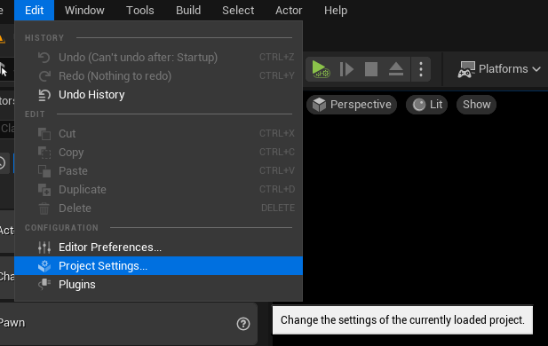
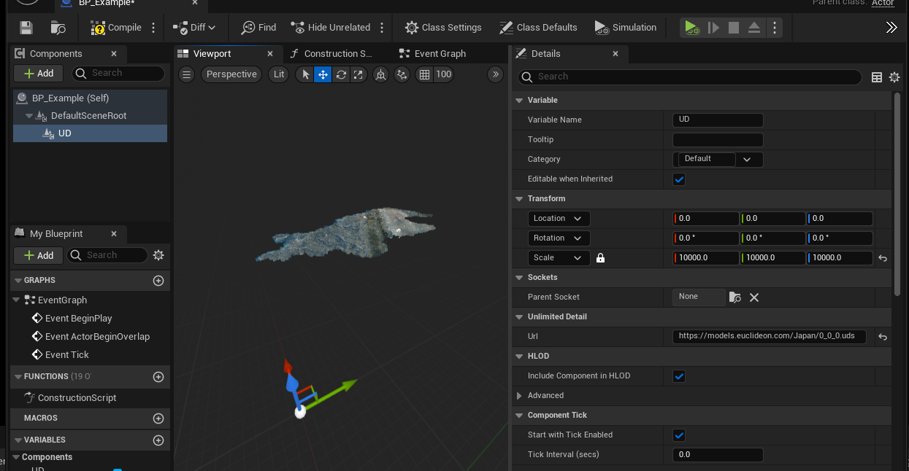

# !DOCS ARE UNDER CONSTRUCTION!
# Unlimited Detail for Unreal guide.

> Euclideon would like to thank community members [zengweicheng666](https://github.com/zengweicheng666) and [EuleeStar](https://github.com/EuleeStar) for their Unreal Engine 4 integration which is available on [GitHub](https://github.com/zengweicheng666/UdSDKProject). The Unreal Engine 5 plugin is built upon the foundation they built for UE4.

# Table of Contents

1. [Quick start summary](#quick-start-summary)
1. [Indepth guide](#indepth-guide)
1. [Additional Info](#bdditional-Info)
1. [Blueprint API](#blueprint-API)
1. [Blueprint examples](#blueprint-examples)

# Quick start summary

1. Ensure you have a valid udCloud API key. A valid key can be acquired for free from:
    1. https://udcloud.com/
1.	Ensure you have Unreal 5.1+ installed: 
    1.	https://docs.unrealengine.com/5.1/en-US/installing-unreal-engine/ 
1.	Ensure you have downloaded and installed the Unlimited Detail Unreal 5 plugin:
    1.	https://my.github.url.to.the.release.of.the.plugin.com 
    1.	https://docs.unrealengine.com/5.0/en-US/working-with-plugins-in-unreal-engine/  
1.	Ensure your API key is entered into the plugins Project Settings, and that the Server field reads `https://udcloud.euclideon.com`: 
    1. 
1.	Restart Unreal (UDS will not start rendering until your API key is logged in, restarting will force that).
1.	Add the UD component to either a scene actor or an existing class:
    1. 
    1. 
1.	Assign a valid UDS URL to the component:
    1. 
    1. 
1.	A test asset can be accessed with the following URL: `https://models.euclideon.com/Japan/0_1_0.uds`
1.	Set the component scale to something large and immediately obvious:
    1. 
1.	Drag the actor into the Scene to begin rendering UDS!
    1. 

# Indepth guide 

## udCloud API Key
In order to use the Unlimited Detail Unreal plugin, you require a udCloud API key.

1. Navigate to https://udcloud.com/
1. Click the sing in/sign up button in the top right:
    - 
1. Clicking the Sign In / Sign up button yields the following window:
    - 
1. Create an account with any of the listed authentication methods.
1. After reading and accepting the EULA, Login. You will be greeted with the following window: 
    - 
1. Click your display name in the top right, to expand the following drop down:
    - 
1. Click "API Keys" to load the following page: 
    - 
1. Click on the top right button: 'Create API Key'
    
1. Enter a display name for the key, and (optionally) specify the number of days this key will be valid for.
1. Click **Create an API key**. It will be listed on the page like so: 
    - 
1. Under the “Options” column, click the **“...”** button on far right.
    - 
1. Click **Copy API Key** to Clipboard. Once copied, you will see the following confirmation:
    - 

For example, the following is the result of pasting the copied clipboard API key:

`eyJhcGlrZXlpZCI6IjAxMjM0NTY3OC0xMTExLTIyMjItMzMzMy00NDQ0NTU1NTY2NjYiLCJ1c2VyaWQiOiIwMTIzNDU2NzgtMTExMS0yMjIyLTMzMzMtNDQ0NDU1NTU2NjY2IiwidmVyc2lvbiI6IjEifQ==`

This API key can be used to authenticate your account to a variety of Euclideon software. Please ensure it is kept secure at all time, as anyone with access to this exact string can use any features your account is authorized to use. We recommend (if possible) ensuring your keys have a valid expiration date suited to your purposes.

Keep this key handy, as it is what we will paste into the Unreal Plugin.
 
## Installing the Unreal Plugin

The Unlimited Detail for Unreal plugin can be acquired either directly from the Unreal Marketplace or from our GitHub releases page, both approaches are equivalent and are detailed below:

## Install the Unreal Plugin – Github Releases

1. Navigate to https://my.github.url.to.the.release.of.the.plugin.com, and click Releases on the right:
1. Download the latest release.
1. Create a new Unreal project. Locate the folder, it should look something like this: 
    - 
1. Create a new folder alongside your .uproject file, and name it `Plugins` :
    - 
1. Open `Plugins` and create a new folder called `UdSDK`
1. Copy the contents of the downloaded release from github into the `UdSDK` folder. The folder should resemble the following:
    - 

# Configuring the Plugin
This procces only needs to be performed once per project, and additionally if your API keys are changed.

1. Copy your API key from your UD Cloud account, it resemble the following: 
`eyJhcGlrZXlpZCI6InRoZXJlaXNub3RoaW5ndXBteXNsZXZlcyIsInVzZXJpZCI6InRoZXJlaXNub3RoaW5ndXBteXNsZXZlcyIsInZlcnNpb24iOiIxMzM3In0=`
1. Load your Unreal Project
1. Initially, the plugin cannot connect to the Unlimited Detail server as it has not been configured, and displays the folllowing error: 
    - 
1. Click Ok.
1. Once loaded, navigate into your Plugins Settings dialogue:
    - 
1. Scroll down the very bottom until you see “Unlimited Detail” on the left:
    - 
1. Ensure that the `Server Path` section reads `https://udcloud.euclideon.com`
1. Paste your API key into the API Key Dialogue.
1. From now on, Unreal will automatically authenticate with the Unlimited Detail server upon project or build start. 
1. If your API key is ever invalidated or fails to authenticate for any reason, you will see the following error:
    - 
1. Restart Unreal!

Your Unlimited Detail plugin is now fully installed and configured and you can begin working with our large point cloud .UDS format.

## Rendering Unlimited Detail Pointcloud within Unreal Engine
Inorder to render Point Cloud assets within Unreal Engine, you must add an Unlimited Detail component to an actor you create. 

1. Right click in your content browser and create a new blueprint actor within your project:
    - 
1. The blueprint can be any subtype, but for now chose actor:
    - 
1. Name, and open your newly created asset. In the Top left, click Add Component, and search for "UD":
    - 
1. Add the UD Component to your actor, your editor should resemble the following:
    - 
1. Ensuring the UD Component is still selected, give it a large and immediately obvious scale:
    - 
1. Locate the "URL" input dialogue under the details panel on the right:
    - 
1. Paste a valid URL into the dialogue. For example: `https://models.euclideon.com/Japan/0_0_0.uds`, and then zoom your view out to locate the Point Cloud
    - 
1. Save your blueprint, then create a new level and drag the actor into the scene:
    - 
    - 

1. Unlimited Detail is now rendering within Unreal 5!

# Additional Info
Local URLs can be used to render .UDS files if you have access to them. Simply paste the absolute path of the asset into the URL dialogue as above, and the .UDS will begin rendering.

# Blueprint API
Currently the Blueprint API is under development and will be expanded in the near future.

## Blueprint examples:
>Space kept intentionally blank.